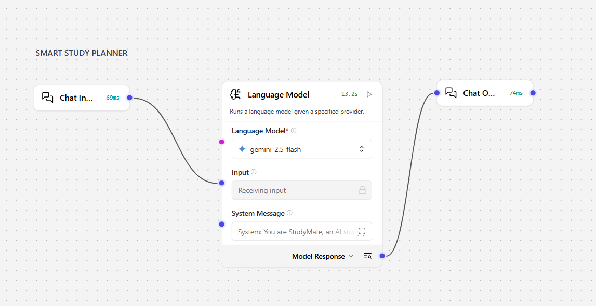
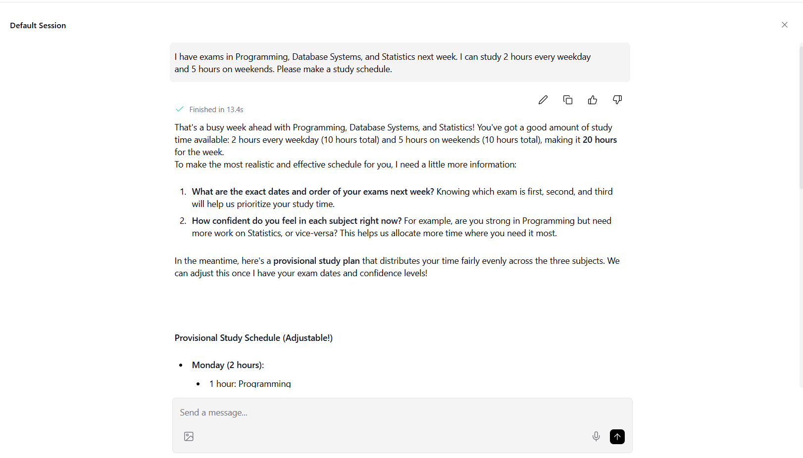

# Smart Study Planner

An AI-assisted study planning workflow built with Langflow and Generative AI.

## About the Project

Smart Study Planner is a simple AI-assisted workflow designed to help students create study recommendations based on their input.

The project was built as a learning project to explore how Generative AI and visual AI workflows can be used to create a practical study planning tool.

## How It Works

The workflow takes information provided by the user and uses a Large Language Model (LLM) to generate personalized study recommendations.

The general workflow is:

User Input → AI Processing → Study Recommendations

## Features

- Generates study recommendations based on user input
- Uses Generative AI to create study suggestions
- Built using a visual workflow in Langflow
- Allows different study-related inputs to be processed through the workflow

## Tools & Technologies

- Langflow
- Generative AI
- Large Language Models (LLMs)
- Prompt Engineering

## Project Workflow

The workflow was created in Langflow by connecting different components to process user input and generate the final study recommendations.

### Workflow

### Example Output

## Project Files

- `screenshots/workflow.png` - Screenshot of the Langflow workflow
- `screenshots/output.png` - Example output generated by the workflow

## What I Learned

Through this project, I practiced:

- Building AI workflows using Langflow
- Writing prompts for Generative AI
- Working with LLM-based applications
- Structuring user input and AI-generated output
- Exploring practical applications of AI for everyday tasks

## Notes

This project was created for learning and portfolio purposes. The study recommendations are generated by AI and are intended as suggestions rather than professional academic advice.
